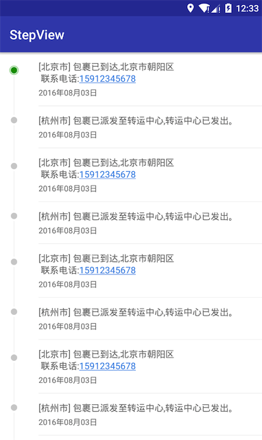
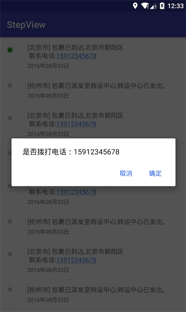

# StepView

> 使用RecyclerView的ItemDecoration实现类似淘宝物流详情的步骤界面，`StepView`继承自`RecyclerView`，用item的装饰器绘制了左侧的步骤节点以及每个item的分隔线。支持指定颜色半径等绘制一个圆点，也支持使用`drawable`资源指定左侧的圆点节点。

#### 效果图
<div>



</div>

#### 添加依赖
```
// add to root build.gralde
allprojects {
	repositories {
		...
		maven { url 'https://jitpack.io' }
	}
}

// add to app build.gradle
dependencies {
    compile 'com.github.dcq123:StepView:v0.0.2'
}

```
#### 使用

在布局文件中添加`StepView`

```xml
<com.github.qing.stepviewlib.StepView
    android:id="@+id/stepView"
    android:layout_width="match_parent"
    android:layout_height="match_parent"
    android:background="#fff"
    app:dotPosition="top"
    app:lineColor="#eee"
    app:lineWidth="1dp"
    app:radius="5dp" />
```

代码中设置数据源以及view的绑定：

```java
// 指定数据集合
stepView.setDatas(datas);
// 设置view的绑定监听
stepView.setBindViewListener(new StepView.BindViewListener() {
    @Override
    public void onBindView(TextView itemMsg, TextView itemDate, Object data) {
        StepItemData sid = (StepItemData) data;
        itemMsg.setText(sid.getMsg());
        itemDate.setText(sid.getDate());
    }
});
```

之所以将view的绑定抽取出来是为了让使用者能够根据自己的需求对view进行控制，比如，在`demo`中就在onBindView方法中对手机号码进行格式化处理，并添加点击后拨打电话逻辑。

#### 属性介绍

| 名称                 | 描述                          |
| ------------------ | --------------------------- |
| leftMargin         | 步骤节点左间距                     |
| rightMargin        | 步骤节点距离右侧文本的右间距              |
| lineWidth          | 左侧步骤线的宽度                    |
| lineColor          | 步骤线的颜色                      |
| radius             | 圆形节点的半径                     |
| defaultDotColor    | 默认节点的显示颜色                   |
| highDotColor       | 高亮节点的显示颜色                   |
| dotPosition        | 圆形节点的显示位置，`top`和`center`两种值 |
| defaultDotDrawable | 默认节点的`drawable`资源           |
| highDotDrawable    | 高亮节点的`drawable`资源           |

PS:当指定了`highDotDrawable`和`defaultDotDrawable`时，就不会去使用默认绘制的圆形节点，所以指定绘制圆形的`radius`或`color`等都会默认忽略，只使用`drawable`资源去填充。而且高亮节点指定在第一个item处。